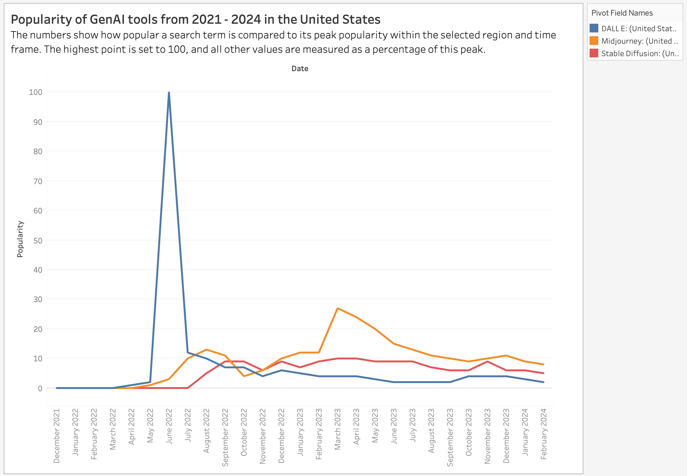

| [home page](https://raslan2000.github.io/My-Portfolio/) | [visualizing debt](https://raslan2000.github.io/My-Portfolio/visualizing-government-debt) | [critique by design](https://raslan2000.github.io/My-Portfolio/critique-by-design) | [final project I](final-project-part-one) | [final project II](final-project-part-two) | [final project III](final-project-part-three) |
# Critique by Design
The purpose of this assignemnt was to chose a graph from makeovermonday and provide an in-depth critique about it based on Stephen Few's "Data Visualization Effectiveness Profile".  This helps me understand if the visualization is effective, provides all the information needed for the audience, shows scopes of improvement for the visualization. I document my thought process here, show my resketches here and show the feedback as well.
## Step one: the visualization

Here is the link to the visualization: https://trends.google.com/trends/explore?date=2022-01-01%202024-02-16&geo=US&q=Midjourney,Stable%20Diffusion,DALL%20E&hl=eng
I chose to critique the graph titled interest over time .
The reason I chose this graph is because at first sight this seemed like a pretty neat chart, but upon pondering, the underlying faults became apparent. It seemed difficult to understand what was going on in this graph. To explore the reasons behind this, I chose to critique it.

## Step two: the critique
### Why Is This Graph Unclear?
- **Lack of a legend:** This creates a confusion as to which lines represents what and there introduces a lack of clarity
- **Not a specific title:** The title even though it gives an idea of the graph, it does not encapsulate the entire information the graph aims to give
- **Not a useful mini graph for the average:** This side mini graph does not serve any purpose and does not provide any clarity on the idea behind the main graph, hence it is just distracting
- **Lack of a clear unit for the y-axis:** Without this, the audience do not know what is being measure and there is no information as such explaining what it is and how it is being measured

## Step three: Sketch a solution
Based on this, I made a first draft to improve this visualization and include the missing features. From there, I arrived at this draft:

## Step four: Test the solution
I presented this draft to a group of students experienced in data and visualizations to get their feedback. Here are their responses:

### Student Feedback

I presented this to a set of students who have worked with data and visualizations before to get their opinion on my first draft. Here are their responses:

- **Student 1:**
    - **What can you understand from the graph?**
        - DALL-E experienced a significant spike in popularity around mid-2022, reaching its peak but quickly declined. Midjourney had a more gradual rise and fall, with smaller peaks in late 2022 and early 2023. Stable Diffusion is following a lower but more consistent trend.
    - **How easily can you understand the graph?**
        - "Popularity" is very vague; a specific metric for how popularity is calculated would be helpful.
    - **Who do you think is the intended audience for this?**
        - Likely Gen AI enthusiasts, business analysts, or market researchers.
    - **Is there anything you would change or do differently?**
        - Explain popularity clearly and define events that might have happened during that time period.

- **Student 2:**
    - **What can you understand from the graph?**
        - Popularity comparison of Gen AI tools across four years monthly.
    - **How easily can you understand the graph?**
        - It took time to understand that popularity is relative (% of the peak). It's confusing, especially around the overlapping parts like August 2022 to February 2023. It’s too granular.
    - **Who do you think is the intended audience for this?**
        - Someone interested in comparing top tools over time.
    - **Is there anything you would change or do differently?**
        - Make the x-axis less granular (e.g., quarterly). Clarify that the y-axis shows relative popularity. Include the actual numbers to show how popularity is measured in reality.

- **Student 3:**
    - **What can you understand from the graph?**
        - It shows how popular a Gen AI tool was compared to others in a specific timeframe.
    - **How easily can you understand the graph?**
        - Not very easily; the popularity scale is confusing.
    - **Who do you think is the intended audience for this?**
        - Gen AI experts, enthusiasts, or newcomers.
    - **Do you have all the information you need for the graph?**
        - No, it’s unclear which region the data represents.
    - **Is there anything you would change or do differently?**
        - Change the y-axis to something more understandable and make the x-axis easier to read (e.g., horizontal labels).

- **Student 4:**
    - **What can you understand from the graph?**
        - Popularity of visual Gen AI platforms.
    - **How easily can you understand the graph?**
        - Pretty easy to understand.
    - **Who do you think is the intended audience for this?**
        - Maybe investors looking to understand trends.
    - **Do you have all the information you need for the graph?**
        - I’d like to know the reason for the peak and the slowdown.
    - **Is there anything you would change or do differently?**
        - I’m curious about how other Gen AI products are doing, not just visual ones.

**Conclusion**:
So based on this feedback, It can be concluded that the popularity being measured was still an issue for the audience to understand and maybe the x-axis was could have been set better. but they were also instances where they were able to draw some insights from the graph which is a plus point as it makes the graph more cleaerer.

## Step five: build the solution

So Finally, based on my critique and the feedback from the interviews I made the following changes to the graph:
- Added a legend
- Gave a more precise title
- Changed the context for better understanding
- Stretched the horizontally so that it can be explored more and the tick marks are in the right orientation
- Labelled the y-axis for clarity

All these changes are shown in this new visualization:

    <noscript>
        
    </noscript>
    <object class='tableauViz' style='display:none;'>
        <param name='host_url' value='https%3A%2F%2Fpublic.tableau.com%2F' />
        <param name='embed_code_version' value='3' />
        <param name='site_root' value='' />
        <param name='name' value='PopularityofGenAItoolsfrom2021-2024inUS/Sheet1' />
        <param name='tabs' value='no' />
        <param name='toolbar' value='yes' />
        <param name='static_image' value='https://public.tableau.com/static/images/Po/PopularityofGenAItoolsfrom2021-2024inUS/Sheet1/1.png' />
        <param name='animate_transition' value='yes' />
        <param name='display_static_image' value='yes' />
        <param name='display_spinner' value='yes' />
        <param name='display_overlay' value='yes' />
        <param name='display_count' value='yes' />
        <param name='language' value='en-US' />
        <param name='filter' value='publish=yes' />
    </object>

