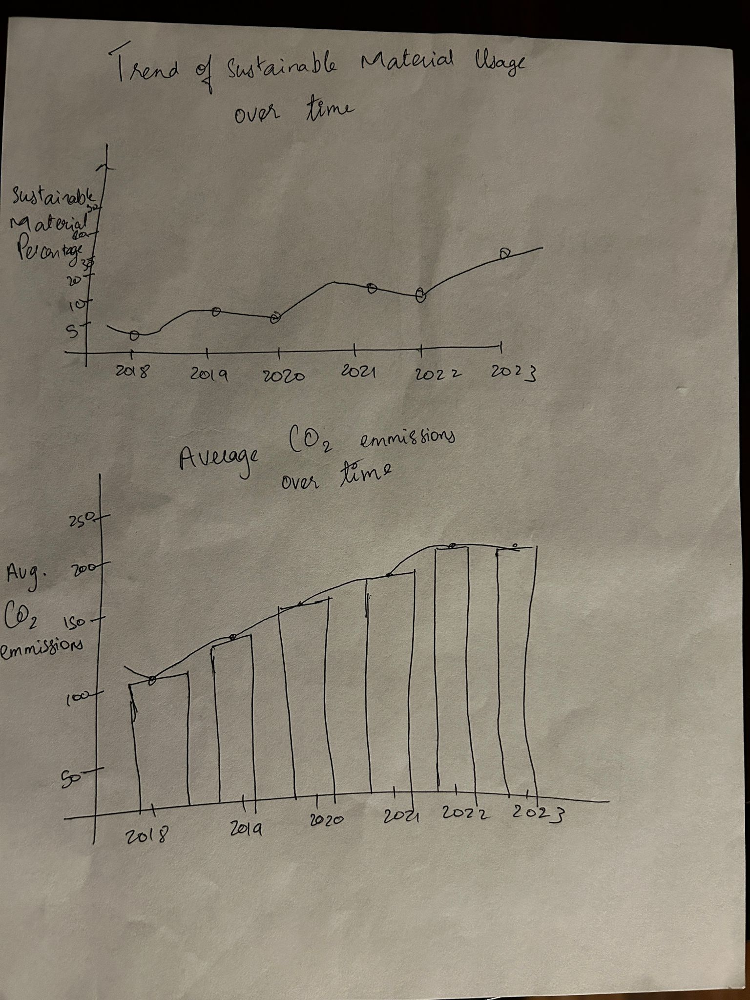
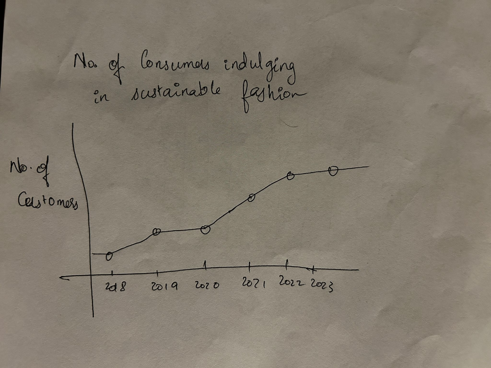

| [home page](https://raslan2000.github.io/My-Portfolio/) | [visualizing debt](https://raslan2000.github.io/My-Portfolio/visualizing-government-debt) | [critique by design](https://raslan2000.github.io/My-Portfolio/critique-by-design) | [final project I](https://raslan2000.github.io/My-Portfolio/final-project-part-one) | [final project II]() | [final project III]() |

# Outline
For this project, I chose to focus on **Sustainable Fashion** because fashion is a big part of our lives and culture, but many people are unaware of sustainable practices. I want to start by highlighting our current situation in fashion and its impacts on the environment, followed by the effects of sustainable fashion, and concluding this project with a call to action.

1. **The Current Landscape**
2. **Towards Sustainable Fashion**
3. **Impact of Sustainable Fashion**
4. **Conclusion and Call to Action**

## Initial sketches

From these rough skecthes I aim to tell my story of about how the fashion industry is harming the environment, how companies are reacting to it and in turn how is the general audience treating this.
# The data
From these datasets, I aim to create graphs that will show the adverse effect of the fashion industry on the environment, how the companies are acting on it, and how it affects consumer behavior.

| Name                                                    | URL                                                                                                       | Description                                                                                                                                                      |
|---------------------------------------------------------|-----------------------------------------------------------------------------------------------------------|------------------------------------------------------------------------------------------------------------------------------------------------------------------|
| Kaggle - Plastic-based Textiles in the Clothing Industry | [Link](https://www.kaggle.com/datasets/purohitgaurav/plastic-based-textiles-in-clothing-industry)        | This Kaggle dataset examines the use of plastic-based textiles in the clothing industry, providing data on environmental impacts and trends related to synthetic materials. |
| Kaggle - Sustainable Fashion and Eco-Friendly Trends    | [Link](https://www.kaggle.com/datasets/waqi786/sustainable-fashion-eco-friendly-trends)                  | This dataset focuses on the rising trend of sustainable fashion focusing on materials, production processes, and popular brands promoting eco-friendly fashion.               |

# Method and medium
So for creating visualizations necessary for this story, I plan on using Tableau and for publishing the story on a page, I would use shorthand.
