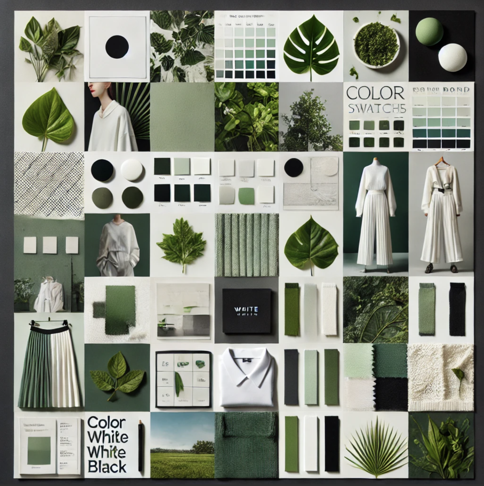

| [home page](https://cmustudent.github.io/tswd-portfolio-templates/) | [visualizing debt](visualizing-government-debt) | [critique by design](critique-by-design) | [final project I](final-project-part-one) | [final project II](final-project-part-two) | [final project III](final-project-part-three) |

# The final data story
The narrative begins by detailing how the fashion industry is destroying the environment and how nothing has changed over time. Consumers are becoming more aware of this, and as a result, they are turning to more sustainable fashion options, increasing the revenue share of the sustainable apparel industry. 

Phillips-Van Heusen (PVH), a corporation that has lately begun to focus on sustainability, is financially profitable and has strong brand awareness. This demonstrates that firms have nothing to lose by transitioning to sustainability.

To summarize, the future of fashion lies in sustainability.
[Here is my story](https://carnegiemellon.shorthandstories.com/towards-sustainable-fashion/index.html).

# Changes made since Part II
Based on the user research and my own intuiotion, here are are some of the changes I made:
1. I changed the narrative to better help the audience understand wha highlight the point I am trying to make
2. Made sure each graph was clearly labelled and the legends were clearly labelled, so that the audience can understand completely what’s going on
3. Replaced the bubble chart from the 2nd visualization to a pie chart, show distinctly how much each segment covers
4. Added more KPIs and other details so that it caters more to the intended audience
5. Changed the moodbaord to match with the sustainability a bit more

## The audience
In this project for me, the target audience can be put under one umbrella: People influential in the fashion industry would include:

1. Business Executives: People in charge of the business within the fashion industry and people who make decisions for the business
2. Policy Makers: These are the people who frame the regulation and guidelines within a company
3. Business Leaders: These include Executives, Strategists and Consultants within the company who make recommendations to the business
4. Fashion Designers: Since some fashion designers also have a brand around them, they can incorporate some of these ideas into their designs

These are the kind of people I am catering to because these are the people who are more likely to make and implement changes within the fashion industry. 

Here is an example persona:

## Final design decisions
For the story, I decided to build dashboards on Tableau and write about the story on Shorthand. The reason I chose dashboard is because the targeted audience would react to dashboards better. I could have made the whole story on dashboard but since there were a lot of data sources to work with. Hence I made a dashboard and built the story on shorthand. 

I also changed the moodboard to match more with the theme of sustainability, hence I chose the colors of green, white and black:

This moodboard was made using chatgpt

The images chosen for the background on each page is meant to match with the topic of each page while still maintaining the moodboard. 

I have also made sure that all pages are left-aligned to reduce eye travel for users when going from one page to another.
Since my targeted audience would react to dashboards and reports better, I have tried to maintain that sort of format with the shorthand. Which is also why I don’t have any callout statistics and thought they would be better on the dashboard.

## References

1. https://www.kaggle.com/datasets/waqi786/sustainable-fashion-eco-friendly-trends
2. https://www.kaggle.com/datasets/purohitgaurav/plastic-based-textiles-in-clothing-industry 
3. https://www.statista.com/forecasts/821415/value-of-the-global-apparel-market 
4. https://www.statista.com/forecasts/1307848/worldwide-sales-of-sustainable-clothing-items 
5. https://www.statista.com/statistics/1303946/sustainability-importance-apparel-purchase/
6. https://www.statista.com/statistics/316668/net-sales-of-the-pvh-corporation-worldwide/ 
7. https://www-statista-com.us1.proxy.openathens.net/statistics/831185/revenues-of-the-largest-global-apparel-companies/

# Final thoughts
Overall this was a fun project to work on. I have been wanting to do some analysis on fashion for a while, So this was a good chance for it. I, myself was able to learn a lot from this project not only in terms of visualizations, but user interviews and the topic itself. I am very grateful for this opportunity to explore this topic and take you along with me on this adventure!
