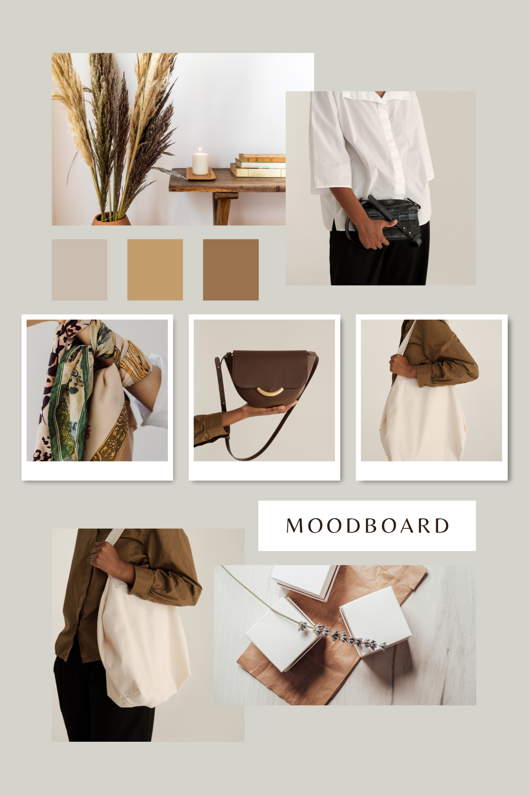

| [home page](https://raslan2000.github.io/My-Portfolio/) | [visualizing debt](https://raslan2000.github.io/My-Portfolio/visualizing-government-debt) | [critique by design](https://raslan2000.github.io/My-Portfolio/critique-by-design) | [final project I](https://raslan2000.github.io/My-Portfolio/final-project-part-one) | [final project II](https://raslan2000.github.io/My-Portfolio/final-project-part-two) | [final project III]() |
# Wireframes / storyboards
Fashion is not only about what we wear on a daily basis or about looking good. It is a medium to express our culture, values and ourselves. But with the rise of fashion, also rose the negative effects our environment, which is why I chose to do this project on **Sustainable Fashion**. By showing how moving to sustainable fashion, I hope to convince individuals to adopt a more environmentally conscious fashion lifestyle and therefore, saving the environment in style.

The story would is structured that such that:

1. We understand the current situation: Where does the problem start? As mentioned earlier, the fashion industry is one of those popular industry that is causing harm to the environment and this need to be dealt with 
2. After the scene has been set, convincing proof is shown to fashion brands and companies to show that switching to sustainable fashion is actually beneficial for them. Hence, proposing a win-win deal.
3. Finally, a  case study is shown about a behemoth company who takes up it as a responsibility to be sustainable and still does well as a business, therefore banging the hammer on the nail and building a strong foundation that “even while running a business, you can be successful”

Then Finally, based on this I will propose a call to action and conclude the story. [Here is a preview of my story](https://preview.shorthand.com/N9WCBe9a7RNGgwsm).

# User research 

## Target audience
The target audience meant for this are influential people within the fashion industry and companies, people who can make can actual change. So ideally, this would be targeted to business leaders, policy makers within the fashion industry, Fashion Brand Executives and fashion designers. 

## Interview script
The point of taking this interview is to make sure the audience can understand what is being conveyed through the visualizations easily and it reaches the right audience. 

| **Goal** | **Questions to Ask** |
| --- | --- |
| To make sure the right message is conveyed | **What can you understand from the visualizations?** |
| To make sure the graph can be easily understood | **How easily can you understand the visualizations?** |
| Evaluate appropriateness for the target audience | **Who do you think is the intended audience? Do you think this is right for intended audience?** |
| To make sure the audience is not overwhelmed or have insufficient information | **Does the visualizations have the right amount of information or not?** |
| Identify potential improvements or modifications | **Is there anything you would change or do differently?** |

## Interview findings
| **Question**                                                                      | **Individual 1**                                                                                                                                                                               | **Individual 2**                                                                                                                                                                                                             | **Individual 3**                                                                                                                             |
|-----------------------------------------------------------------------------------|------------------------------------------------------------------------------------------------------------------------------------------------------------------------------------------------|----------------------------------------------------------------------------------------------------------------------------------------------------------------------------------------------------------------------------|----------------------------------------------------------------------------------------------------------------------------------------------------------------------------------|
| **What can you understand from all the visualizations?**                          | I can understand that the fashion businesses have contributed towards the destruction of the environment at a large scale and that adopting a more sustainable approach can be profitable to the environment, the users of the brand, as well as the company.            | I can understand the importance of sustainable fashion. I can understand the shift towards sustainable fashion over the years and how it affects the companies and their revenue.                                            | Overall, all the visualizations give a very apt understanding of how moving to sustainable materials for fashion may or may not affect companies.                                   |
| **How easily can you understand the visualizations?**                             | The graphs displayed are very easy to comprehend and deliver the intended impact.                                                                                                              | The visualizations are easy to understand. The color theme is consistent throughout as well.                                                                                                                                | Very easily                                                                                                                                |
| **Who do you think is the intended audience? Do you think this is right for intended audience?** | Assuming that the audience consists of all the leading clothing/accessories companies, the data displayed caters well to them.                                                                  | The data seems to be increasing awareness about sustainable fashion to the general public or maybe people who are interested in fashion.                                                                                    | Economists, people working in fashion, political majors.                                                                                   |
| **Does the visualizations have the right amount of information or not?**           | Yes                                                                                                                                                                                            | Yea, it does.                                                                                                                                                                                                               | I think it is the right amount                                                                                                             |
| **Is there anything you would change or do differently?**                         | I would suggest including the data from smaller companies too, giving a broader perspective on the adoption of sustainable approaches.                                                          | I would suggest having the visualization insights after displaying the plots. Some KPIs could have a better color layout such as dark colors. The bubble graph has some unknown labels which makes it difficult to understand and so I would not consider the bubble graph. I would make the title of the dashboard bigger in font compared to the title of each visualization. | No                                                                                                                                                                                                                                                             |

# Identified changes for Part III
| **Research synthesis** | **Anticipated changes for Part III** |
| --- | --- |
| Show information regarding smaller companies | Find data regarding smaller companies and make visualizations based on them |
| Lack of clarity in some graphs | To make sure the graphs are labelled and marked properly and everything is clearly visible |
| Bubble graph was a bit difficult to understand | Revise the bubble graph by either clarifying the labels or replacing it with a more understandable visualization. |
| One interviewee mentioned that visualizations should have insights displayed next to them. | Include brief insights or explanations next to each visualization to improve the audience’s understanding of the data presented. |
| Insufficient Information | Add more information regarding KPIs and other details so that it caters more to the intended audience |

# Moodboards / personas
I am planning to follow this moodboard to further emphasize the idea of this project.

